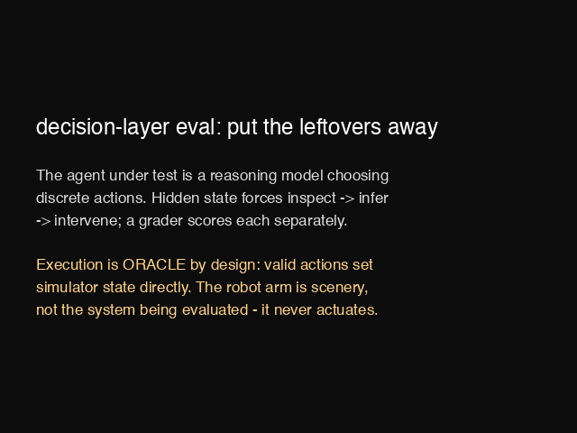

# rlenv

Verified environments and evals for physical reasoning, built by [Second Nature Labs](https://snlabs.dev).

## Why these environments exist

Frontier coding models wrote the physics for the first environment in this repo, and four times they wrote physics that was confidently wrong and *passed the automated test suite*: load-sag inversion, a downstream node reading above its upstream node, a red-herring battery that drifted into being a second real fault, and a ground fault too small to localize. All four were caught by a human playing the environment with a technician's eye.

> Generation is cheap and getting cheaper. Verification is not. That asymmetry is the reason this repo exists.

## Environments

| Environment | What it is |
|---|---|
| [**no-start-env**](no-start-env.md) | Agentic vehicle no-start diagnosis: node-potential physics, cheat-resistant grader, Inspect-compatible, live on [OpenReward](https://openreward.ai/jaivir/no-start-env). |
| [**decision-layer**](decision-layer/) | Hidden-state kitchen task on RoboCasa/MuJoCo: inspect, infer, intervene — graded separately from motor execution (oracle by design). |

## Headline results — no-start-env

| Tier | Model | Mean |
|---|---|---:|
| Frontier | `anthropic/claude-fable-5` | 86.0 |
| Frontier | `openai/gpt-5.5` | 82.3 |
| Frontier | `grok/grok-4` | 74.9 |
| Frontier | `anthropic/claude-sonnet-5` | 74.5 |
| Deployment | `google/gemini-3.5-flash` | 59.7 |
| Deployment | `anthropic/claude-haiku-4-5` | 39.9 |
| Open 3B–8B | `mistralai/ministral-3b` | 23.0 |
| Open 3B–8B | `qwen/qwen-2.5-7b` | 20.9 |
| Open 3B–8B | `meta-llama/llama-3.1-8b` | 7.2 |

Frontier models have cleared textbook short-horizon automotive diagnosis — 59 of 60 easy/medium episodes with full root-cause credit — but the hard tier is not saturated: frontier models earn full root-cause credit on just 15 of 40 hard episodes, and no model of the nine passes every episode. The deployment tier — the cost/latency class that would actually run on a robot — fails a tier earlier: it loses the red-herring scenario most of the time, typically anchoring on the decoy battery and swapping innocent parts on a car whose fault is a $25 ground strap.

Full table, metric definitions, and methodology: [no-start-env.md](no-start-env.md).

## decision-layer

The agent under test is a reasoning model, not a motor policy. It is told *"put the leftovers away in the fridge"* and controls a RoboCasa kitchen through discrete primitives — `open`, `pick`, `place`, `discard`, `declare`, `done` — receiving structured text observations of what is currently visible. Execution is **oracle by design**: a valid primitive succeeds perfectly by setting simulator state directly. What is being measured is the decision sequence — **inspect → infer → intervene** — isolated from grasping and motion the same way no-start-env isolates diagnosis from wrench-turning.

The task is built so that **the correct next action cannot be determined from the initial observation.** Each seeded episode hides one of three world states, and the closed fridge door is the information boundary — a fixture's interior is observable only while its door is open:

| hidden state | what the agent must figure out | wrong-but-plausible default |
|---|---|---|
| `nominal` | the fridge has shelf space — confirm, then shelve | shelving *without* checking happens to work here, which is exactly why it earns no inference credit |
| `fridge_full` | the shelf is at capacity and one item is expired — discard it, then shelve | grab the leftovers first, discover the full shelf mid-task, backtrack; or throw out fresh food to make room |
| `container_missing` | the leftovers aren't on the counter; a blinking microwave clock is the cue to look there | open every appliance in sequence instead of reading the cue |

The first two variants are byte-identical in the initial observation (pinned by test), so an agent that acts on the default assumption is betting, not reasoning. A three-way grader (0–100) scores each skill separately: **inference (40)** — did it identify the actual hidden state, with credit gated on the revealing observation occurring *before* the declaration, so lucky guesses earn nothing; **parsimony (25)** — targeted inspection beats inspect-everything spam, negative past 2× the expert action count; **intervention (35)** — end-state predicates checked against simulator geometry, never against the agent's claims. In live traces, claude-haiku-4-5 exhibits the signature failure the task exists to expose: it grabs the leftovers before looking inside the fridge, hits the full shelf, and pays five actions of backtracking — inference and intervention stay clean while parsimony isolates the act-before-inspect error.

*The reactive scripted expert solving all three hidden-state variants for 100.0 each; captions are real action → observation pairs. The arm never actuates; the decision layer is the system under test.*

Task design, grader details, adversarial audit, and install: [decision-layer/](decision-layer/).

## Shared discipline

Every environment ships with a multi-part grader, an adversarial audit, and a statement of what the grader does not yet catch: for no-start-env, the [audit](results/audit.md) and the [Limitations section](no-start-env.md#limitations); for decision-layer, [AUDIT.md](decision-layer/AUDIT.md) and [LIMITS.md](decision-layer/handoff/LIMITS.md).

## Contact

jaivir@snlabs.dev · [snlabs.dev](https://snlabs.dev)
